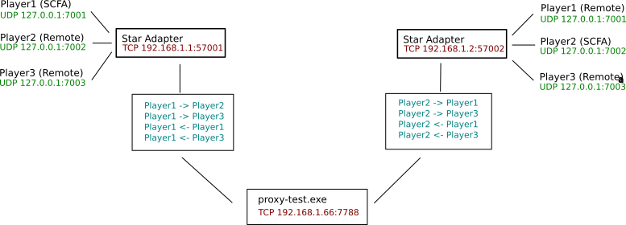

# Intro

Current fork completely remove the ICE-P2P layer (for the science) and use centralized server that multiplex traffic over the single TCP connection.

# Build on Windows

  # debug
  ./grandlew.bat createAllJars
  # release
  ./gradlew -Pversion="7.7.7" -PjavafxPlatform=win -PjavafxClasspath=compileOnly :ice-adapter:shadowJar

- backup your `FAF Client/natives/faf-ice-adapter.jar`
- replace `faf-ice-adapter.jar` with `faf-star-adapter\build\libs\ice-adapter-snapshot.jar`
- optional, add FAF_PROXY windows environment variable if you need to change default server address
 
